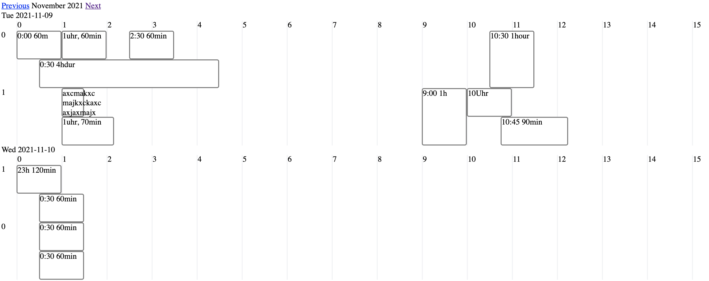
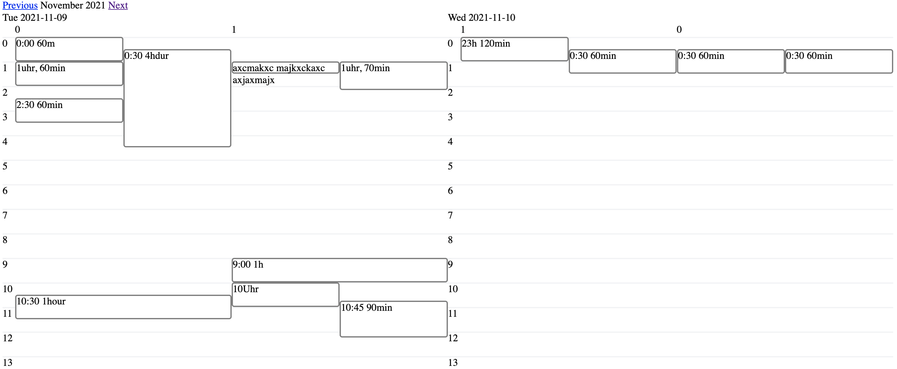

# SimpleCalendar::Timeslot

This is an extension of the rubygem `simple_calendar` by Chris Oliver aka excid3. It allows 
for simple calendar creation in a Ruby on Rails app with an timeslot representation of events 
in a 24h day. 

This helps to visually grasps the length of events and the time between them. In case of overlapping, the respective events are shown side-by-side. It is also possible to categorise events in buckets according to some function, then they will be shown next to one another in the 24h timeline.

Horizontal and vertical layout is selectable via options, just like many other ones.

Horizontal example


Vertical example



## Installation

Add this line to your application's Gemfile:

```ruby
gem 'simple_calendar-timeslot'
```

And then execute:

    $ bundle install

Or install it yourself as:

    $ gem install simple_calendar-timeslot


**Important** Then include the stylesheet in your rails app.

If you an `application.css` file, include the following:
```ruby
*= require simple_calendar-timeslot
```
If you use an SCSS file (`application.scss`), add the following line instead:
```ruby
@import 'simple_calendar-timeslot';
```

## Usage

TODO: Write usage instructions here

```erb
<%= timeslot_calendar(events: @events,
                      number_of_days: 2,
                      px_per_minute: 1.5,
                      orientation: :horizontal,
                      horizontal_height_px: 250,
                      # display_grid: false,
                      # display_bucket_title: :event_type,
                      # bucket_title_size: 30,
                      # grid_width: "20px",
                      # split_by_type: :event_type
                     ) do |event| %>
  <div class="timeslot-event">
    <%= event.title %>
  </div>
<% end %>

```

Shortversion in the meantime:
- orientation (:vertical, :horizontal, default: :vertical)
- horizontal_height_px default: 300
- split_by_type (model function to call in case of bucketung f.ex.`:event_type`, default: false)
- px_per_minute default: 0.65
- display_bucket_title (model function to call in case of bucketung f.ex.`:event_type_name`, default: false)
- bucket_title_size default: 20
- grid_width default: 20px
- display_grid default: true

## Development

After checking out the repo, run `bin/setup` to install dependencies. Then, run `rake test` to run the tests. You can also run `bin/console` for an interactive prompt that will allow you to experiment.

To install this gem onto your local machine, run `bundle exec rake install`. To release a new version, update the version number in `version.rb`, and then run `bundle exec rake release`, which will create a git tag for the version, push git commits and the created tag, and push the `.gem` file to [rubygems.org](https://rubygems.org).

## Contributing

Bug reports and pull requests are welcome on GitHub at https://github.com/1klap/simple_calendar-timeslot.
